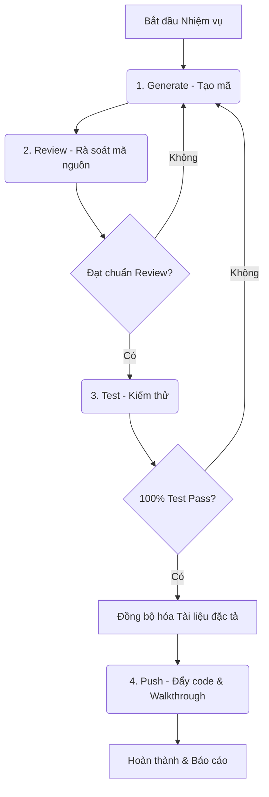

# Quy trình Tích hợp Generate - Review - Test - Push

Tài liệu này hướng dẫn cách kết hợp và vận hành chu trình làm việc 4 bước **Generate - Review - Test - Push** để phát triển các tính năng và sửa lỗi một cách an toàn, đáng tin cậy.

## 1. Sơ đồ Quy trình Công việc

Chu trình làm việc được thực hiện theo dạng vòng lặp tuần tự:

## 2. Chi tiết Quy trình và Cổng kiểm soát (Gates)

### Bước 1: Generate (Tạo mã nguồn)
- **Hành động**: Phân tích yêu cầu từ `PROJECT_REQUIREMENTS.md` và các đặc tả hiện có trong `docs/cores/` để triển khai viết code.
- **Cổng ra (Exit Gate)**: Mã nguồn đã viết xong, không có code giả hay ghi chú TODO dở dang.

### Bước 2: Review (Rà soát mã nguồn)
- **Hành động**: Tự rà soát (Self-review) toàn bộ những dòng code đã thay đổi/thêm mới.
- **Tiêu chuẩn**:
  - Không có code rác, code debug dư thừa (`console.log`, `print`...).
  - Toàn bộ chú thích (comments) trong mã nguồn viết bằng **Tiếng Việt**.
- **Lưu ý quan trọng**: *Tuyệt đối không thực hiện cập nhật hay đồng bộ vào các file tài liệu đặc tả ở bước này* để tránh làm sai lệch/rác tài liệu khi logic code chưa được kiểm thử và xác nhận hoạt động ổn định.
- **Cổng ra (Exit Gate)**: Mã nguồn sạch, tối ưu và tuân thủ các quy tắc định dạng.

### Bước 3: Test (Kiểm thử tự động)
- **Hành động**: Chạy toàn bộ bộ test suite và viết bổ sung ca kiểm thử cho phần code mới.
- **Tiêu chuẩn**: Tất cả các ca test phải đạt trạng thái **PASS (100% thành công)**.
- **Cổng ra (Exit Gate)**: Đạt tỷ lệ pass 100%, code chạy ổn định và chính xác hoàn toàn.

### Bước trung gian: Đồng bộ hóa Tài liệu đặc tả (Doc-Code Sync)
- **Hành động**: *Chỉ thực hiện sau khi mã nguồn đã hoàn thành và vượt qua kiểm thử thành công (100% OK).*
- **Nội dung**: Đối chiếu các thay đổi thực tế trong mã nguồn (ví dụ: thay đổi bảng dữ liệu, thêm Endpoint API mới, thay đổi quyền truy cập) để cập nhật đồng bộ ngược lại vào các file đặc tả tương ứng trong `docs/cores/` (như `01-database.md`, `02-backend.md`, `04-security.md`, `05-testing.md`).

### Bước 4: Push (Đẩy code lên repository)
- **Hành động**: Dọn dẹp tệp rác, cập nhật tệp `walkthrough.md` ghi nhận sự thay đổi của cả **Mã nguồn** và **Tài liệu đặc tả**, sau đó tiến hành commit.
- **Tiêu chuẩn**: Commit rõ ràng theo chuẩn Conventional Commits.
- **Cổng ra (Exit Gate)**: Code và tài liệu đặc tả đã đồng bộ được đẩy lên remote branch thành công.

---

## 3. Quy tắc Kỷ luật Quy trình
1. **Tuyệt đối không đi tắt**: Không được bỏ qua bất kỳ bước nào trong chu trình làm việc.
2. **Đồng bộ đúng thời điểm**: Chỉ đồng bộ hóa tài liệu đặc tả sau khi code đã được kiểm thử và xác định là **100% OK** (sau Bước 3). Tránh việc cập nhật tài liệu sớm từ bước Generate hoặc Review để tránh tài liệu bị rác hoặc sai lệch thiết kế.
3. **Đồng bộ tài liệu là bắt buộc**: Khi kết thúc một đầu việc thành công, tài liệu đặc tả trong `docs/cores/` phải khớp hoàn toàn với thực tế mã nguồn hiện tại.

