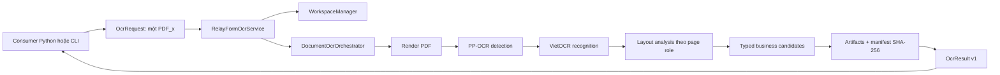

# Kiến trúc OCR_PRJ và Local API v1

Tài liệu này mô tả implementation đã khóa tại Local API `1.0`, schema `1.0`, CLI
schema `1.0` và pipeline `0.7.0`. Đây là kiến trúc chạy local trên cùng server,
không phải kiến trúc HTTP/service phân tán.

## Luồng chính

Mọi call đồng bộ và chỉ trả đúng một terminal `OcrResult`. Model được khởi tạo
VietOCR/PyTorch trước PaddleOCR/Paddle và được tái sử dụng khi caller giữ cùng một
`RelayFormOcrService` instance.

## Các package production

| Thành phần | Trách nhiệm |
|---|---|
| `src.relay_form_ocr.schemas` | Typed request/result/error contract v1. |
| `src.relay_form_ocr.service` | Public synchronous API, validation, mapping và lifecycle. |
| `src.relay_form_ocr.orchestrator` | Render, OCR, page routing, layout và aggregation. |
| `src.relay_form_ocr.workspace` | Workspace reservation, path safety, source/artifact audit. |
| `src.relay_form_ocr.observability` | ProgressEvent và redacted JSONL logging. |
| `src.relay_form_ocr.cli` | JSON subprocess adapter, stream và exit-code contract. |
| `src.detection` | PP-OCR detection và red-stamp suppression. |
| `src.recognition` | VietOCR recognition. |
| `src.layout_analysis.page1` | Page-1 structure-first fields và confidence evidence. |
| `src.layout_analysis.page3_plus` | Page-3+ setting/note candidates. |

Production code không import Streamlit, `src.debug_ui` hoặc `lab`. Debug UI gọi
production orchestrator; `lab` chỉ phục vụ thử nghiệm.

## Page-role policy

- Page 1: trả đủ 25 canonical fields khi xử lý thành công. Existing
  structure-owned values được bảo toàn; resolution evidence và năm mức confidence
  hỗ trợ review.
- Page 2: hiện `skipped_by_policy` và tạo warning; không bị bỏ qua âm thầm.
- Page 3+: trả setting/note candidates, luôn `review_required` cho đến khi có
  ground-truth metrics và business gate được duyệt.
- Table 02 Page 1: đang nằm ngoài extractor v1 và được ghi rõ là skipped.

## Trust boundary

Request được phép chứa absolute local `input_pdf` và `output_root`; result public
không lặp lại internal absolute paths. Consumer chịu trách nhiệm cung cấp một PDF_x
và correlation ID an toàn. Runtime:

1. Xác minh PDF/path và reserve độc quyền `output_root/<correlation_id>`.
2. Không tái sử dụng hoặc ghi đè workspace đã tồn tại.
3. Chặn traversal, absolute artifact path, symlink và Windows reparse escape.
4. Hash source trước/sau và ghi `source_unchanged`.
5. Ghi physical artifact manifest nguyên tử với size/SHA-256.
6. Chỉ trả artifact ID và POSIX-style relative path.

Không có authentication/token vì v1 không mở network transport. ACL/service
account, allowed roots, malware boundary, resource limits và audit actor đầy đủ
vẫn thuộc PLAN-013 trước production rollout.

## Public result và review gate

`status` mô tả xử lý kỹ thuật: `success`, `success_with_warnings`, `failed`.
`review_status` mô tả quyền sử dụng dữ liệu: `not_required`, `review_required`.
Hai trạng thái độc lập; xử lý thành công không đồng nghĩa dữ liệu được duyệt.

Consumer chỉ được dùng dữ liệu tự động khi contract và artifact audit đều hợp lệ,
đồng thời `review_status=not_required`. Page 3+, note, warning hoặc confidence gate
có thể buộc duyệt. Reference consumer từ chối toàn result nếu schema, path,
manifest, size hoặc checksum sai.

## Progress, log và error

Public callback nhận immutable `ProgressEvent`, total 100, completed đơn điệu.
Success kết thúc đúng một terminal 100/100; failure kết thúc ở tiến độ thật.
Callback lỗi bị vô hiệu nhưng không làm sai terminal OCR result.

JSONL log mặc định không chứa PDF path, OCR text, exception message hoặc traceback.
CLI giữ stdout cho machine JSON và ghi log/model output vào stderr. Mười hai public
error codes và bảy stages được khóa trong
[error catalog](contracts/local_api/v1/error_catalog.json).

## Versioning và compatibility

- Local API/schema/CLI v1 hiện là `1.0`; pipeline là `0.7.0`.
- Additive optional fields được phép trong cùng major nếu consumer/fixture cũ vẫn
  validate.
- Xóa/rename field, đổi type/nullability, enum/error semantics hoặc artifact base
  phải tăng major schema/API.
- Pipeline có thể tăng độc lập nhưng terminal output phải validate theo declared
  schema.
- Machine-readable release state nằm trong
  [release manifest](contracts/local_api/v1/release_manifest.json).

## Deployment boundary

V1 hiện chạy từ source checkout; repository root phải nằm trên `PYTHONPATH` khi
consumer chạy từ cwd khác. Chưa có wheel, dependency lock, offline model bundle,
upgrade/rollback runbook hoặc support matrix chính thức. Các phần này thuộc
PLAN-009 và PLAN-018; không được suy diễn từ acceptance rằng runtime đã
production-ready.

## Verification evidence

Acceptance CPU trên Windows 11/CPython 3.12.13 đạt 10/10 executions, 8/8 layout
families, 69 trang thật, stable repeat, invalid-PDF failure contract, source
immutability và full artifact audit. Cả chín run thật vẫn cần review. Tham khảo
[API.md](API.md) để chạy integration và [manual.md](manual.md) để tái xác minh.
