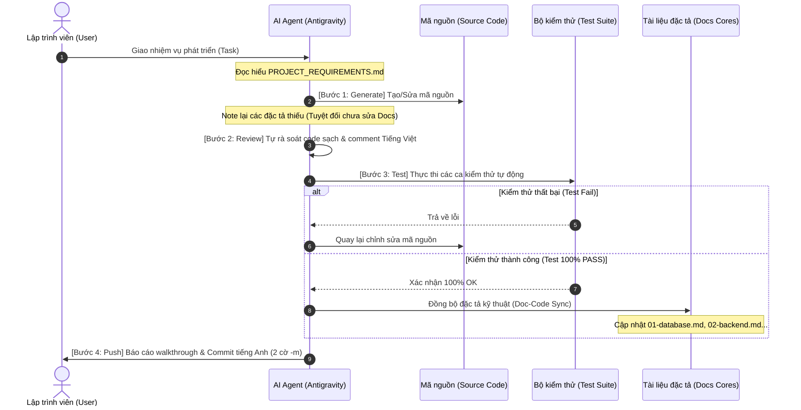

# Khung Làm Việc Cộng Tác AI-Native (AgenticAI) 🚀🤖

**AgenticAI** là bộ khung boilerplate chuẩn hóa quy trình phát triển phần mềm cộng tác giữa **Con người (Developer)** và **AI Agent** (như Antigravity, Claude, v.v.). Bộ khung này giải quyết bài toán "lệch pha" giữa tài liệu đặc tả (Documentation) và mã nguồn (Code), thiết lập kỷ luật kiểm thử chặt chẽ và chuẩn hóa cách commit dữ liệu.

---

## 📁 Cấu Trúc Thư Mục và Vai Trò

```text
📦 AgenticAI (hoặc thư mục dự án của bạn)
 ┣ 📂 .antigravity            # "Bộ não" vận hành của AI Agent
 ┃ ┣ 📂 rules                 # Các quy định lập trình bắt buộc
 ┃ ┃ ┗ 📜 comment.md          # Quy tắc chú thích (Comment Tiếng Việt, Code Tiếng Anh)
 ┃ ┗ 📂 skills                # Các kỹ năng nâng cao của Agent
 ┃   ┣ 📂 lifecycles          # Chu trình phát triển cốt lõi (Vòng đời phát triển)
 ┃   ┃ ┣ 📜 01-generate.md    # Bước 1: Tạo/Sửa mã nguồn dựa trên thiết kế
 ┃   ┃ ┣ 📜 02-review.md      # Bước 2: Tự rà soát chất lượng code sạch
 ┃   ┃ ┣ 📜 03-test.md        # Bước 3: Chạy test tự động (Phải đạt 100% Pass)
 ┃   ┃ ┗ 📜 04-push.md        # Bước 4: Commit tiếng Anh (2 cờ -m) & đẩy code
 ┃   ┗ 📜 workflow.md         # Tệp điều phối chính quy trình (Orchestrator)
 ┣ 📂 docs                    # Kho tri thức kỹ thuật của dự án (Source of Truth)
 ┃ ┣ 📂 cores                 # Các tài liệu đặc tả nền tảng hệ thống (Base Specs)
 ┃ ┃ ┣ 📜 01-database.md      # Thiết kế cơ sở dữ liệu toàn cục
 ┃ ┃ ┣ 📜 02-backend.md       # Cấu trúc Backend & Thiết kế Modular MVC
 ┃ ┃ ┣ 📜 03-frontend.md      # Giao diện & Design System
 ┃ ┃ ┣ 📜 04-security.md      # Bảo mật & Phân quyền (JWT, Session, RBAC...)
 ┃ ┃ ┣ 📜 05-testing.md       # Quy chuẩn chạy test & chiến lược Mocking
 ┃ ┃ ┗ 📜 06-deployment.md    # Quy trình đóng gói CI/CD
 ┃ ┣ 📂 features              # Đặc tả chi tiết các phân hệ nghiệp vụ cụ thể (Feature Specs)
 ┃ ┗ 📂 walkthroughs          # Tài liệu hướng dẫn sử dụng (User Manuals) dành cho Dev/User
 ┣ 📜 ANTIGRAVITY.md          # Bản đồ định hướng chính cho AI Agent
 ┗ 📜 PROJECT_REQUIREMENTS.md # Yêu cầu nghiệp vụ chi tiết của sản phẩm (SRS)
```

---

## 🔄 Quy Trình Phát Triển (Development Lifecycle)

Quy trình phát triển trong **AgenticAI** là một chu trình khép kín nhằm bảo vệ chất lượng mã nguồn và tài liệu.



### 🔄 Chi Tiết Chu Trình Phát Triển 4 Bước

Quy trình phát triển trong **AgenticAI** bắt buộc AI Agent và Lập trình viên phải tuân thủ nghiêm ngặt 4 bước cốt lõi sau:

1.  **Bước 1: Generate (Tạo mã nguồn)**
    *   **Nhiệm vụ**: Phân tích yêu cầu nghiệp vụ từ `PROJECT_REQUIREMENTS.md` và các đặc tả hiện có trong `docs/cores/` để triển khai viết code.
    *   **Nguyên tắc**: Viết mã nguồn hoàn chỉnh (không dùng code giả hoặc ghi chú TODO). Mã nguồn đặt tên bằng Tiếng Anh, chú thích bằng Tiếng Việt (theo `comment.md`). Tuyệt đối chưa chỉnh sửa các tài liệu đặc tả chính thức ở bước này.

2.  **Bước 2: Review (Tự rà soát)**
    *   **Nhiệm vụ**: Agent tự rà soát (Self-review) toàn bộ những dòng code đã thay đổi/thêm mới để dọn dẹp code rác, code debug dư thừa (`console.log`, `print`...).
    *   **Nguyên tắc**: Ghi nhận và chuẩn bị danh sách các tài liệu đặc tả sẽ cần đồng bộ hóa (như database schema mới, API endpoints mới) nhưng chưa cập nhật trực tiếp vào file tài liệu chính thức.

3.  **Bước 3: Test (Kiểm thử tự động)**
    *   **Nhiệm vụ**: Chạy toàn bộ bộ test suite và viết bổ sung ca kiểm thử cho phần code mới.
    *   **Nguyên tắc**: Tất cả các ca test phải đạt trạng thái **PASS (100% thành công)**.
    *   **Cổng kiểm soát Đồng bộ (Doc-Code Sync Gate)**: Ngay sau khi test vượt qua 100% thành công, Agent thực hiện cập nhật đồng bộ các thay đổi thực tế vào các file đặc tả kỹ thuật tương ứng trong `docs/cores/` hoặc `docs/features/`.

4.  **Bước 4: Push (Đẩy code lên repository)**
    *   **Nhiệm vụ**: Dọn dẹp tệp rác, cập nhật tệp báo cáo `walkthrough.md` và tiến hành commit.
    *   **Nguyên tắc**: Commit viết bằng Tiếng Anh và sử dụng tối đa **2 cờ `-m`** (cờ 1 cho Title chuẩn Conventional Commits, cờ 2 cho Body mô tả các thay đổi chi tiết). Đẩy code lên remote branch của dự án.

### ⚠️ Nguyên tắc Vòng lặp Đồng bộ Tài liệu (Doc-Code Sync Loop)
*   **KHÔNG** đồng bộ tài liệu đặc tả ở **Bước 1 (Generate)** hoặc **Bước 2 (Review)**. Lúc này code chưa chạy ổn định, việc đồng bộ sớm dễ làm rác tài liệu.
*   **CHỈ** đồng bộ tài liệu ở bước trung gian **sau khi Bước 3 (Test) đã PASS 100%**. Việc này đảm bảo tài liệu trong `docs/` luôn phản ánh chính xác logic code đã hoạt động thành công.

---

## 🛠️ Hướng Dẫn Dành Cho Lập Trình Viên (Developer Guide)

### Bước 1: Khởi Tạo Dự Án Mới
1. Sao chép toàn bộ thư mục `.antigravity/`, `docs/`, `ANTIGRAVITY.md` và `PROJECT_REQUIREMENTS.md` vào dự án mới của bạn.
2. Thiết lập cấu hình Git và cài đặt bộ kiểm thử (Jest, Mocha, v.v.).

### Bước 2: Thiết Lập Yêu Cầu Nghiệp Vụ (SRS)
1. Mở tệp `PROJECT_REQUIREMENTS.md` (đã được dựng sẵn dưới dạng template SRS chuẩn).
2. Điền thông tin dự án của bạn vào các mục: Phạm vi (Scope), Tác nhân (Actors), và danh sách User Stories chi tiết kèm mã định danh cụ thể (ví dụ: `[US-USER-01]`).

### Bước 3: Định Nghĩa Các Đặc Tả Nền Tảng (Base Specs)
1. Trước khi viết code, hãy định nghĩa các thông số kỹ thuật cốt lõi trong `docs/cores/`:
   *   `01-database.md`: Thiết kế trước các bảng dữ liệu ban đầu.
   *   `02-backend.md`: Thống nhất cấu trúc thư mục code và thiết kế API.
   *   `04-security.md`: Quy định cơ chế xác thực.
2. Việc này giúp AI Agent luôn có một "la bàn kỹ thuật" để bám sát, tránh sinh code lạc đề hoặc sai kiến trúc.

### Bước 4: Ra Lệnh Cho AI Agent
Khi làm việc với AI Agent, hãy luôn nhắc nhở Agent tuân thủ chỉ dẫn trong [ANTIGRAVITY.md](file:///ANTIGRAVITY.md). Khi đó, Agent sẽ tự động chạy theo chu trình 4 bước (`lifecycles/`) mà không cần bạn phải nhắc lại từng bước.

### Bước 5: Kiểm Tra và Tiếp Nhận Commit
Khi Agent hoàn thành, bạn sẽ nhận được một tệp `walkthrough.md` chi tiết và một yêu cầu commit. Hãy kiểm tra:
*   Mã nguồn viết bằng **Tiếng Anh**.
*   Chú thích giải thích lý do viết bằng **Tiếng Việt**.
*   Thông điệp commit viết bằng **Tiếng Anh** sử dụng tối đa **2 cờ `-m`** phân tách:
    ```bash
    git commit -m "feat(auth): add password recovery" -m "- implement otp service\n- design forgot-password UI"
    ```

---

## 🔌 Hướng Dẫn Mở Rộng Hệ Thống Kỹ Năng (Adding Custom Skills)

Để mở rộng khả năng của AI Agent mà không phá vỡ quy trình cốt lõi, hãy làm theo quy tắc sau:

1.  **Vị trí**: Đặt các file kỹ năng bổ trợ trực tiếp vào thư mục `.antigravity/skills/`.
2.  **Quy tắc đặt tên**:
    *   **Bắt buộc giữ tiền tố số từ `01-` đến `04-`** cho các tệp trong thư mục con `lifecycles/` (Quy trình cốt lõi).
    *   **KHÔNG dùng tiền tố số** cho các kỹ năng bổ trợ tự do bên ngoài để tránh nhầm lẫn với chuỗi quy trình.
    *   *Ví dụ*:
        *   `.antigravity/skills/lifecycles/01-generate.md` (Cốt lõi)
        *   `.antigravity/skills/refactor.md` (Kỹ năng phụ trợ)
        *   `.antigravity/skills/db-migrate.md` (Kỹ năng phụ trợ)
3.  **Cách gọi kỹ năng bổ trợ**: Bạn có thể định nghĩa trong `workflow.md` hoặc chỉ định trực tiếp cho Agent: *"Hãy sử dụng kỹ năng `db-migrate.md` để thực hiện tác vụ này"*.
