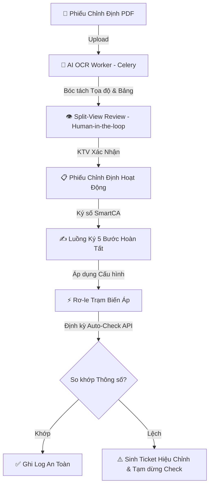

# ⚡ EVN RMS — Hệ Thống Quản Lý Rơ-le & Phiếu Chỉnh Định Kỹ Thuật Số

<div align="center">


**Giải pháp Chuyển đổi số Toàn diện cho Ngành Điện lực (EVN): Số hóa Phiếu Chỉnh Định, Bóc Tách AI OCR On-Premise, Ký Số SmartCA & Giám Sát Rơ-le Thời Gian Thực**

[Tính Năng Nổi Bật](#-tính-năng-nổi-bật) • [Kiến Trúc Hệ Thống](#-kiến-trúc-hệ-thống) • [Cài Đặt & Triển Khai](#-cài-đặt--triển-khai) • [Tài Khoản Mặc Định](#-tài-khoản-thử-nghiệm-mặc-định) • [Mô-đun AI OCR](#-hệ-thống-ai-ocr-on-premise) • [Tài Liệu Kỹ Thuật](#-tài-liệu-kỹ-thuật)

</div>

---

## 📖 Giới Thiệu Tổng Quan

**EVN RMS (Relay Management System)** là nền tảng quản lý kỹ thuật cao cấp, được thiết kế chuyên biệt phục vụ các Công ty Điện lực, Trung tâm Điều độ và Đội Quản lý Vận hành Trạm Biến áp. Hệ thống giải quyết trọn vẹn bài toán chuyển đổi số từ khâu tiếp nhận thông số chỉnh định, bóc tách dữ liệu thông minh, phân công công tác, ký số xác nhận hiện trường đến đối soát tự động thông số vận hành của rơ-le.

### Điểm Vượt Trội:
- 🛡️ **Bảo mật tuyệt đối On-Premise**: Mô-đun AI OCR xử lý 100% nội bộ, tuân thủ nghiêm ngặt tiêu chuẩn an toàn thông tin lưới điện truyền tải và phân phối (OT Compliance).
- ✍️ **Ký số chuẩn EVN SmartCA**: Quy trình 5 bước nghiêm ngặt (Phân phối ➔ Trạm ➔ Kỹ thuật ➔ Giám sát ➔ Ban hành), mã hóa chữ ký SHA-256 kèm OTP/PIN bảo mật.
- ⚡ **Hiệu năng cao & Realtime**: Xây dựng trên Django ASGI (Daphne), Redis Caching, WebSockets (Django Channels) và Celery Worker xử lý bất đồng bộ.
- 🎨 **Giao diện Hiện đại (Modern UI/UX)**: Tone màu chuẩn EVN Corporate, hỗ trợ tương tác tức thì (HTMX), Glassmorphism cards và biểu đồ trực quan (Chart.js).

---

## 🌟 Tính Năng Nổi Bật


```mermaid
graph TD
    A[📄 Phiếu Chỉnh Định PDF] -->|Upload| B[🤖 AI OCR Worker - Celery]
    B -->|Bóc tách Tọa độ & Bảng| C[👁️ Split-View Review - Human-in-the-loop]
    C -->|KTV Xác Nhận| D[📋 Phiếu Chỉnh Định Hoạt Động]
    D -->|Ký số SmartCA| E[✍️ Luồng Ký 5 Bước Hoàn Tất]
    E -->|Áp dụng Cấu hình| F[⚡ Rơ-le Trạm Biến Áp]
    F -->|Định kỳ Auto-Check API| G{So khớp Thông số?}
    G -->|Khớp| H[✅ Ghi Log An Toàn]
    G -->|Lệch| I[⚠️ Sinh Ticket Hiệu Chỉnh & Tạm dừng Check]
```

### 1. Quản Lý Phiếu Chỉnh Định & AI OCR (Human-in-the-Loop)
- **Bóc tách tự động**: Tự động nhận diện layout bảng, thông số kỹ thuật (dòng điện, điện áp, thời gian tác động, chức năng 50/51, 87, 21...) kèm tọa độ bounding box và điểm tin cậy (confidence score).
- **Giao diện Split-View đối chiếu**: Trực quan hóa file PDF song song với biểu mẫu chỉnh sửa. Highlight vị trí dữ liệu trên bản scan khi tương tác trường thông tin; cảnh báo trường có độ tin cậy thấp (<80%).
- **Phiếu chỉnh định tạm thời (Temporary Setting)**: Đặt thời hạn hiệu lực, tự động hoàn trả (revert) về cấu hình chuẩn ban đầu khi hết hạn qua Celery Beat.
- **Thao tác hàng loạt & Xuất báo cáo**: Phê duyệt hàng loạt, xuất dữ liệu Excel/PDF theo biểu mẫu EVN.

### 2. Luồng Ký Số Đa Bước Mô Phỏng EVN SmartCA
- **Quy trình chuẩn mực 5 bước**:
  1. `DISPATCHER` (Điều độ viên / Phân phối): Tạo phiếu, rà soát kết quả AI OCR, ký phát hành.
  2. `STATION_LEADER` (Trưởng trạm / Lãnh đạo trạm): Tiếp nhận phiếu, phân công cho Kỹ thuật viên phụ trách.
  3. `TECHNICIAN` (Kỹ thuật viên): Cài đặt thông số thực tế tại rơ-le và ký xác nhận hiện trường.
  4. `SUPERVISOR` (Giám sát viên): Kiểm tra chéo thông số và ký biên bản giám sát nghiệm thu.
  5. `ADMIN` (Lãnh đạo phê duyệt): Ký phê duyệt ban hành chính thức vào hồ sơ vận hành.
- **Mã PIN / OTP giả lập**: Giao diện xác thực nhập mã PIN bảo mật, sinh mã băm SHA-256 chống chối bỏ.
- **Stepper trực quan**: Trục tiến trình trạng thái thời gian thực với biểu tượng sinh động theo từng bước ký.

### 3. Quản Lý Hạ Tầng Lưới Điện & Giám Sát Định Kỳ
- **Mô hình hóa dữ liệu chuyên sâu**: Đơn vị Quản lý ➔ Trạm Biến Áp (Station) ➔ Ngăn Lộ (Bay) ➔ Thiết Bị / Rơ-le (Relay).
- **Tự động kiểm tra định kỳ (Auto Check Scheduler)**: Cấu hình tần suất kiểm tra linh hoạt (theo Giây, Phút, Giờ, Ngày, Tháng, Năm hoặc 1 lần cụ thể).
- **Tự động phát hiện bất thường**: So khớp giá trị thực tế thu thập từ API với thông số định mức của phiếu hiệu lực. Nếu có sai lệch, tự động chuyển sang quy trình **Phiếu Hiệu Chỉnh (Correction Ticket)** và tạm dừng chu kỳ kiểm tra để đảm bảo an toàn.

### 4. Danh Mục Chuẩn & Đồng Bộ API Ngoại Vi
- **10+ Danh mục kỹ thuật**: Đơn vị quản lý, Nước sản xuất, Hãng sản xuất, Cấp điện áp, Loại thiết bị, Trạng thái vận hành, Đường dây, Công trình, Vị trí.
- **Tích hợp API hai chiều**: Hỗ trợ RESTful API định dạng **JSON** và **XML**, đồng bộ hóa tự động dữ liệu từ hệ thống quản lý kỹ thuật cấp Tổng công ty.

### 5. Thông Báo Thời Gian Thực & Dashboard Thông Minh
- **WebSockets Real-time**: Thông báo chuông (Notification Badges) tự động cập nhật ngay khi có phiếu mới hoặc yêu cầu ký số mà không cần F5 tải lại trang.
- **Dashboard thích ứng theo vai trò**: Giao diện dashboard thay đổi thông minh theo quyền hạn người dùng (Dispatcher, Kỹ thuật viên, Trưởng trạm, Giám sát, Quản trị viên).

---

## 🛠 Công Nghệ Sử Dụng

| Tầng Kiến Trúc | Công Nghệ / Thư Viện | Mục Đích |
| :--- | :--- | :--- |
| **Backend Framework** | Python 3.12+, Django 6.x / 5.x | Xử lý nghiệp vụ chính, ORM, bảo mật |
| **ASGI Server** | Daphne, Channels 4.x | Hỗ trợ WebSockets và kết nối bất đồng bộ |
| **Task Queue & Cache** | Celery 5.x, Celery Beat, Redis 7 | Xử lý OCR ngầm, quét định kỳ, Redis caching & session |
| **Database** | PostgreSQL 15 | Cơ sở dữ liệu quan hệ, JSONField tối ưu |
| **Frontend Core** | HTMX, TailwindCSS, Vanilla JS | Tải trang SPA-like siêu mượt, UI chuẩn chỉnh |
| **Icons & Charts** | FontAwesome 6, Chart.js | Giao diện đồ họa, thống kê trực quan |
| **AI OCR Pipeline** | PaddleOCR, VietOCR, Poppler, OpenCV | Bóc tách PDF/Ảnh phiếu chỉnh định nội bộ (`OCR_PRJ`) |
| **Container & CI/CD** | Docker, Docker Compose, Cloudflare Tunnel | Đóng gói môi trường, triển khai sản xuất |

---

## 📁 Cấu Trúc Mã Nguồn

```text
dien-luc/
├── core/                     # Ứng dụng cốt lõi: Auth, Profile, RBAC, Tasks, WS Consumers, Sync API
│   ├── management/commands/  # Scripts quản trị: seed_permissions, seed_users, seed_data
│   ├── utils/                # api_sync.py, xml_converter.py
│   └── views.py              # Xử lý Dashboard, Auth, Notifications, Profile
├── stations/                 # Quản lý Trạm, Ngăn lộ, Rơ-le, Lịch kiểm tra định kỳ, Correction Tickets
├── sheets/                   # Quản lý Phiếu Chỉnh Định, Ký số, OCR Job, Split-View Review
├── checks/                   # Nhật ký kiểm tra thông số định kỳ & so khớp dữ liệu
├── categories/               # Danh mục kỹ thuật (Đường dây, Công trình, Hãng SX, Vị trí...)
├── rms_project/              # Cấu hình dự án Django: settings.py, urls.py, asgi.py, wsgi.py, celery.py
├── templates/                # Giao diện HTML (Django Templates + HTMX)
├── static/                   # CSS, JS, hình ảnh giao diện
├── OCR_PRJ/                  # Mô-đun AI OCR On-premise (Pipeline bóc tách PDF chuyên dụng)
│   ├── src/relay_form_ocr/   # Mã nguồn OCR: Orchestrator, table extractor, parser
│   ├── scripts/              # Script khởi tạo venv OCR & Debug UI
│   └── README.md             # Tài liệu chi tiết Local API OCR
├── scripts/                  # Script tự động hóa hệ thống (setup_ocr_env.ps1)
├── docs/                     # Tài liệu thiết kế chi tiết (Database, Backend, Frontend, Features)
├── docker-compose.yml        # Cấu hình khởi chạy trọn gói Docker đa dịch vụ
├── Dockerfile                # Docker image cho ứng dụng web & celery worker
├── requirements.txt          # Danh sách thư viện Python phụ thuộc
├── seed_users_stations.py    # Khởi tạo 20 trạm biến áp, rơ-le và 65 tài khoản mẫu
├── seed.py                   # Sinh 2000 phiếu chỉnh định mẫu phục vụ kiểm thử tải
└── run.py                    # Script chạy đồng thời Django Server, Celery Worker & Beat
```

---

## 🚀 Cài Đặt & Triển Khai

### Cách 1: Triển Khai Nhanh Bằng Docker (Khuyên Dùng Cho Production)

Hệ thống được đóng gói sẵn Docker Compose bao gồm: PostgreSQL, Redis, Django Web Server (Daphne), Celery Worker và Cloudflare Tunnel.

```bash
# 1. Clone mã nguồn
git clone https://github.com/xh1712006-debug/electric.git
cd electric

# 2. Tạo file cấu hình môi trường từ mẫu
cp .env.example .env

# 3. Khởi chạy toàn bộ hệ thống
docker compose up -d --build
```

Container `web` sẽ tự động thực thi:
- Thu thập tài nguyên tĩnh (`collectstatic`).
- Cập nhật cơ sở dữ liệu (`migrate`).
- Khởi tạo 5 nhóm quyền tự động (`seed_permissions`).
- Tạo tài khoản Superuser mặc định (`admin`).
- Chạy ASGI Server qua Daphne trên cổng `9000`.

Truy cập hệ thống tại: **`http://localhost:9000`**

---

### Cách 2: Hướng Dẫn Cài Đặt & Chạy Môi Trường Cục Bộ (Local Development)

Dành cho nhà phát triển muốn chạy trực tiếp mã nguồn trên máy tính (Windows, Linux, macOS) để debug hoặc phát triển tính năng mới.

#### 1. Yêu Cầu Tiên Quyết (Prerequisites)
- **Python**: Phiên bản `3.10` – `3.12` (64-bit).
- **PostgreSQL 15+** & **Redis Server**:
  > 💡 **Mẹo tiện lợi**: Nếu chưa cài PostgreSQL/Redis trên máy tính, bạn có thể chạy riêng 2 dịch vụ này bằng Docker siêu nhanh:
  > ```powershell
  > docker compose up -d db redis
  > ```
- **Git** & **PowerShell** (hoặc Bash shell trên Linux/macOS).

---

#### 2. Bước 1: Khởi Tạo Môi Trường Ảo & Cài Đặt Thư Viện Django

Mở Terminal / PowerShell tại thư mục dự án `dien-luc`:

```powershell
# 1. Khởi tạo môi trường ảo Python
python -m venv venv

# 2. Kích hoạt môi trường ảo
.\venv\Scripts\Activate.ps1   # Trên Windows PowerShell
# source venv/bin/activate    # Trên Linux / macOS

# 3. Cài đặt các thư viện phụ thuộc của ứng dụng Web
pip install --upgrade pip
pip install -r requirements.txt
```

---

#### 3. Bước 2: Thiết Lập Biến Môi Trường `.env`

Tạo file `.env` từ file mẫu `.env.example`:

```powershell
Copy-Item .env.example .env   # Trên Linux/macOS: cp .env.example .env
```

Mở file `.env` và kiểm tra cấu hình kết nối Database & Redis:
```ini
DEBUG=True
SECRET_KEY=django-insecure-dev-local-secret-key-change-in-production
DB_HOST=127.0.0.1
DB_PORT=5440                 # 5440 nếu dùng DB từ docker-compose, hoặc 5432 nếu dùng Postgres cài trực tiếp
DB_NAME=rms_db
DB_USER=postgres
DB_PASSWORD=your_db_password
REDIS_URL=redis://127.0.0.1:6379/1

# Cấu hình tài khoản Superuser tự động
DJANGO_SUPERUSER_USERNAME=admin
DJANGO_SUPERUSER_PASSWORD=admin
DJANGO_SUPERUSER_EMAIL=admin@example.com
```

---

#### 4. Bước 3: Cài Đặt Môi Trường Riêng Cho Mô-đun AI OCR (`OCR_PRJ`)

Mô-đun AI OCR sử dụng pipeline nhận diện bảng và bóc tách PDF nội bộ nằm trong thư mục `OCR_PRJ`. Để khởi tạo môi trường ảo độc lập cho OCR:

```powershell
# Trên Windows: Chạy script tự động cài đặt môi trường OCR
powershell -NoProfile -ExecutionPolicy Bypass -File .\scripts\setup_ocr_env.ps1
```
*(Script sẽ tự động tạo thư mục `OCR_PRJ/.venv`, cài đặt PaddleOCR, VietOCR, Poppler và tải sẵn các model OCR cần thiết).*

---

#### 5. Bước 4: Khởi Tạo Cơ Sở Dữ Liệu & Dữ Liệu Mẫu

Chạy các lệnh quản trị Django để chuẩn bị hệ thống:

```powershell
# 1. Cập nhật schema Cơ sở dữ liệu
python manage.py migrate

# 2. Khởi tạo 5 nhóm quyền chuẩn EVN (Admin, Dispatcher, Station Leader, Technician, Supervisor)
python manage.py seed_permissions

# 3. Nạp 20 Trạm biến áp, ngăn lộ, rơ-le và 65 tài khoản thử nghiệm
python seed_users_stations.py

# 4. (Tùy chọn) Nạp 2.000 phiếu chỉnh định mẫu phục vụ kiểm thử hiệu năng
python seed.py
```

---

#### 6. Bước 5: Khởi Chạy Ứng Dụng Local

##### ⚡ Lựa chọn A: Khởi chạy 1 lệnh duy nhất (Khuyên Dùng)
Dự án đã xây dựng sẵn script `run.py` để tự động khởi chạy đồng thời **Django Server**, **Celery Worker** và **Celery Beat**:

```powershell
python run.py
```
> Script sẽ giữ cả 3 dịch vụ chạy song song và hiển thị log trực tiếp trên màn hình console. Nhấn `Ctrl + C` để dừng toàn bộ.

---

##### 🛠️ Lựa chọn B: Khởi chạy thủ công từng dịch vụ (Dành cho Debug chi tiết)
Mở 3 cửa sổ Terminal riêng biệt (đều đã kích hoạt môi trường ảo `.\venv\Scripts\Activate.ps1`):

- **Terminal 1 — Web Server (Hỗ trợ WebSockets Real-time qua Daphne hoặc Runserver)**:
  ```powershell
  # Chạy qua Daphne (Khuyên dùng để có đầy đủ tính năng thông báo Real-time):
  daphne -b 127.0.0.1 -p 8000 rms_project.asgi:application
  
  # Hoặc chạy qua Django runserver:
  python manage.py runserver 127.0.0.1:8000
  ```

- **Terminal 2 — Celery Worker (Xử lý bóc tách OCR ngầm)**:
  ```powershell
  # Trên Windows (bắt buộc tham số --pool=solo):
  celery -A rms_project worker --pool=solo -l info
  
  # Trên Linux / macOS:
  celery -A rms_project worker -l info
  ```

- **Terminal 3 — Celery Beat (Lên lịch tự động kiểm tra rơ-le & hoàn trả phiếu tạm)**:
  ```powershell
  celery -A rms_project beat -l info
  ```

---

#### 7. Bước 6: Truy Cập & Trải Nghiệm Hệ Thống

Mở trình duyệt web và truy cập địa chỉ:
👉 **`http://127.0.0.1:8000`** *(hoặc `http://localhost:8000`)*

---

### 🔧 Xử Lý Sự Cố Khi Chạy Local (Troubleshooting)

| Vấn đề / Lỗi | Nguyên nhân | Cách khắc phục |
| :--- | :--- | :--- |
| **`ConnectionRefusedError: [Errno 111] Connect to Redis/Postgres failed`** | Redis hoặc PostgreSQL chưa khởi động hoặc sai cổng kết nối. | Chạy lệnh `docker compose up -d db redis` hoặc kiểm tra lại `DB_PORT`, `REDIS_URL` trong file `.env`. |
| **`Celery Worker bị treo hoặc không nhận Task trên Windows`** | Celery mặc định dùng prefork không tương thích hoàn toàn với Windows. | Luôn thêm cờ `--pool=solo` khi chạy Celery Worker trên Windows: `celery -A rms_project worker --pool=solo -l info`. |
| **`Không thấy chuông thông báo Real-time cập nhật`** | Server chạy qua `runserver` chuẩn HTTP thay vì ASGI Daphne. | Khởi chạy máy chủ bằng lệnh: `daphne -b 127.0.0.1 -p 8000 rms_project.asgi:application`. |
| **`Lỗi OCR Python interpreter not found`** | Chưa khởi tạo môi trường ảo cho `OCR_PRJ`. | Chạy script `powershell -NoProfile -ExecutionPolicy Bypass -File .\scripts\setup_ocr_env.ps1`. |

---

## 👥 Tài Khoản Thử Nghiệm Mặc Định

Sau khi chạy lệnh `seed_users_stations.py`, hệ thống tự động khởi tạo các tài khoản phân quyền chuẩn:

| Vai Trò (Role) | Tên Đăng Nhập Mẫu | Mật Khẩu | Quyền Hạn Chính |
| :--- | :--- | :--- | :--- |
| **Quản trị viên (Admin)** | `admin` | `admin` *(hoặc `999999`)* | Toàn quyền cấu hình, phân quyền, duyệt ban hành |
| **Điều độ viên (Dispatcher)** | `dispatcher_1` ... `dispatcher_5` | `123456` | Tạo phiếu, chạy OCR, phân phối phiếu cho trạm |
| **Trưởng nhóm Trạm (Leader)** | `station_leader_1` ... `station_leader_15` | `123456` | Tiếp nhận phiếu tại trạm, phân công Kỹ thuật viên |
| **Kỹ thuật viên (Technician)** | `technician_1` ... `technician_30` | `123456` | Cài đặt thông số thực tế, ký số nghiệm thu tại trạm |
| **Giám sát viên (Supervisor)** | `supervisor_1` ... `supervisor_15` | `123456` | Giám sát chéo thông số, ký biên bản giám sát |

---

## 🤖 Hệ Thống AI OCR On-Premise

Hệ thống OCR được tích hợp tại thư mục [OCR_PRJ](file:///OCR_PRJ/README.md) theo chuẩn Local API v1:

- **Đặc tả API**: Nhận đường dẫn file PDF gốc, thực hiện bóc tách Layout, trích xuất bảng thông số, tính toán tọa độ (Bounding Box) và độ tin cậy (Confidence).
- **Cơ chế gọi**: Celery Task gọi trực tiếp Subprocess / Local Python API của `OCR_PRJ`, lưu kết quả JSON vào trường `extracted_data` của phiếu và chuyển trạng thái sang `ISSUED` (Chờ rà soát).
- **Độ an toàn**: 100% dữ liệu không gửi ra internet, đáp ứng tiêu chuẩn an toàn cho hệ thống trọng yếu của EVN.

---

## 📚 Tài Liệu Kỹ Thuật Chi Tiết

Hệ sinh thái tài liệu kỹ thuật được lưu trữ chi tiết trong thư mục `docs/`:

- [Tài Liệu Quản Lý Trạm & Thiết Bị](docs/features/01-station-management.md)
- [Quy Trình Quản Lý Phiếu Chỉnh Định](docs/features/02-calibration-sheet.md)
- [Đặc Tả Quy Trình Ký Số Điện Tử](docs/features/03-digital-signature.md)
- [Cơ Chế Kiểm Tra Định Kỳ & Xử Lý Lỗi](docs/features/04-periodic-check.md)
- [Kiến Trúc Mô-đun AI OCR (Human-in-the-Loop)](docs/features/05-ai-ocr.md)
- [Thiết Kế Cơ Sở Dữ Liệu Chi Tiết](docs/cores/01-database.md)
- [Thiết Kế Kiến Trúc Backend & API](docs/cores/02-backend.md)
- [Quy Chuẩn Giao Diện Frontend](docs/cores/03-frontend.md)
- [Tiêu Chuẩn An Toàn & Bảo Mật](docs/cores/04-security.md)

---

## 🛡️ Bản Quyền & Giấy Phép

Dự án được phát triển phục vụ mục đích chuyển đổi số công tác quản lý kỹ thuật rơ-le bảo vệ trong Tập đoàn Điện lực Việt Nam (EVN). Mọi quyền được bảo lưu.
