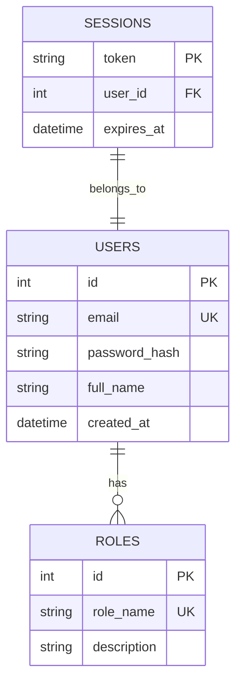

# Thiết kế Cơ sở Dữ liệu (Database Design)

Tài liệu này đặc tả thiết kế cơ sở dữ liệu của dự án, bao gồm sơ đồ quan hệ (ERD), cấu trúc các bảng chi tiết và các quy tắc quản lý dữ liệu.

## 1. Sơ đồ Thực thể Quan hệ (ERD)

Dưới đây là sơ đồ quan hệ giữa các thực thể chính trong hệ thống (sử dụng Mermaid):

## 2. Đặc tả Chi tiết các Bảng (Tables Specification)

### Bảng: `users`
Dùng để lưu trữ thông tin tài khoản người dùng hệ thống.

| Tên trường (Column) | Kiểu dữ liệu (Type) | Ràng buộc (Constraints) | Mô tả (Description) |
| :--- | :--- | :--- | :--- |
| `id` | INT | PRIMARY KEY, AUTO_INCREMENT | Khóa chính tự tăng |
| `email` | VARCHAR(255) | UNIQUE, NOT NULL | Địa chỉ email để đăng nhập |
| `password_hash` | VARCHAR(255) | NOT NULL | Mật khẩu đã được băm an toàn |
| `full_name` | VARCHAR(100) | NULL | Họ và tên người dùng |
| `created_at` | DATETIME | DEFAULT CURRENT_TIMESTAMP | Thời điểm tạo tài khoản |

### Bảng: `roles`
Dùng để phân vai trò cho người dùng (ví dụ: Admin, User).

| Tên trường (Column) | Kiểu dữ liệu (Type) | Ràng buộc (Constraints) | Mô tả (Description) |
| :--- | :--- | :--- | :--- |
| `id` | INT | PRIMARY KEY, AUTO_INCREMENT | Khóa chính tự tăng |
| `role_name` | VARCHAR(50) | UNIQUE, NOT NULL | Tên vai trò (ADMIN, USER...) |
| `description` | TEXT | NULL | Mô tả quyền hạn của vai trò |

---

## 3. Quy tắc Đặt tên & Quản lý Migrations
- **Quy tắc đặt tên**:
  - Tên bảng: Sử dụng danh từ số nhiều, viết thường, ngăn cách bằng dấu gạch dưới (snake_case) (ví dụ: `users`, `user_profiles`).
  - Tên cột: snake_case (ví dụ: `created_at`, `password_hash`).
- **Khóa ngoại**: Luôn đặt tên cột khóa ngoại theo định dạng `{tên_bảng_số_ít}_id` (ví dụ: `user_id`).
- **Migrations**: Tất cả các thay đổi cấu trúc DB phải được thực hiện thông qua file Migration, tuyệt đối không sửa đổi DB trực tiếp trên môi trường staging/production.
