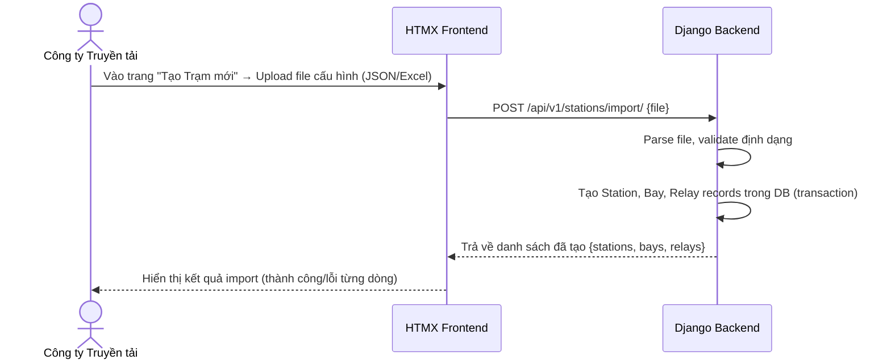

# Phân hệ Quản lý Trạm, Ngăn lộ & Rơ-le (Station Management)

> [!WARNING]
> Phân hệ này đã được dời sang Giai đoạn 5 (Module Tài sản) theo SRS mới nhất. Trong phiên bản MVP, hệ thống không quản lý danh mục thiết bị chi tiết mà lưu dưới dạng văn bản trong Phiếu chỉnh định. Tài liệu dưới đây mang tính chất tham khảo cho tương lai.

**App Django**: `apps/stations`
**User Stories liên quan**: `[US-STN-01]` đến `[US-STN-05]`

---

## 1. Tổng quan Nghiệp vụ

Phân hệ này cho phép **Công ty Truyền tải** (user chính) quản lý toàn bộ danh mục hạ tầng vật lý của lưới điện truyền tải, bao gồm 3 cấp độ:

```
Trạm Biến áp (Station)
 └── Ngăn lộ / Bay (Bay)
       └── Rơ-le Bảo vệ (Relay)
             └── Thông số Định mức (RelaySetting)
```

---

## 2. Luồng Nghiệp vụ Chi tiết

### 2.1 Tạo Dự án (Trạm Biến áp) từ File Cấu hình [US-STN-01]

Đây là **Figure 1** trong tài liệu UseCase gốc.



**Định dạng file cấu hình (JSON)**:
```json
{
  "station": {
    "code": "TBA_220KV_HOA_BINH",
    "name": "Trạm biến áp 220kV Hòa Bình",
    "location": "Tỉnh Hòa Bình",
    "voltage_level": "220kV"
  },
  "bays": [
    {
      "code": "BAY_AT1",
      "name": "Ngăn Máy biến áp AT1",
      "bay_type": "Máy biến áp",
      "relays": [
        {
          "code": "REL_AT1_87T",
          "name": "Rơ-le so lệch biến áp AT1",
          "manufacturer": "ABB",
          "model_number": "RET670",
          "serial_number": "SN-2024-001",
          "settings": [
            { "code": "ID_MIN", "name": "Dòng khởi động tối thiểu", "standard_value": 0.2, "unit": "A", "tolerance_min": 0.18, "tolerance_max": 0.22 },
            { "code": "TD_1", "name": "Thời gian tác động cấp 1", "standard_value": 0.0, "unit": "s", "tolerance_min": 0.0, "tolerance_max": 0.02 }
          ]
        }
      ]
    }
  ]
}
```

### 2.2 Quản lý Thủ công Trạm / Ngăn lộ / Rơ-le [US-STN-02..05]

- **Xem danh sách**: Bảng có tìm kiếm theo tên/mã, lọc theo cấp điện áp, phân trang 20 bản ghi/trang.
- **Tạo mới thủ công**: Form nhập từng trường, validation ngay trên FE (Django Forms / HTML5 Validation).
- **Chỉnh sửa**: Các trường có thể sửa (tên, địa điểm, trạng thái active). Không cho phép sửa mã (code) sau khi tạo.
- **Vô hiệu hóa**: Đặt `is_active = False`, không xóa vật lý. Các bản ghi con (bay, relay) không bị ảnh hưởng.

---

## 3. Business Rules (Quy tắc Nghiệp vụ)

| # | Quy tắc |
|---|---|
| BR-STN-01 | Mã trạm (`station_code`) phải là duy nhất trong toàn hệ thống. |
| BR-STN-02 | Không thể xóa trạm nếu còn ngăn lộ đang hoạt động. |
| BR-STN-03 | Không thể vô hiệu hóa rơ-le nếu đang có phiếu chỉnh định ở trạng thái DRAFT hoặc ISSUED. |
| BR-STN-04 | Giá trị `tolerance_min` phải luôn nhỏ hơn `tolerance_max` trong thông số định mức. |
| BR-STN-05 | Import file: Nếu `station_code` đã tồn tại, hệ thống hỏi xác nhận trước khi ghi đè. |

---

## 4. API Endpoints Chi tiết

### POST `/api/v1/stations/`
**Quyền**: `TRANSMISSION_COMPANY`

**Request Body**:
```json
{
  "station_code": "TBA_220KV_HA_NOI",
  "station_name": "Trạm biến áp 220kV Hà Nội",
  "location": "Quận Hoàng Mai, Hà Nội",
  "voltage_level": "220kV"
}
```

**Response (201)**:
```json
{
  "success": true,
  "message": "Tạo trạm biến áp thành công",
  "data": {
    "id": 5,
    "station_code": "TBA_220KV_HA_NOI",
    "station_name": "Trạm biến áp 220kV Hà Nội",
    "is_active": true,
    "bays_count": 0
  }
}
```

### POST `/api/v1/stations/import/`
**Quyền**: `TRANSMISSION_COMPANY`
**Content-Type**: `multipart/form-data`

**Form Fields**:
- `file`: File JSON hoặc Excel cấu hình trạm

**Response (200)**:
```json
{
  "success": true,
  "message": "Import hoàn tất",
  "data": {
    "created_stations": 1,
    "created_bays": 3,
    "created_relays": 8,
    "errors": []
  }
}
```

---

## 5. Giao diện (UI Specification)

### Màn hình Danh sách Trạm (`/stations`)
- **Header**: Tiêu đề "Quản lý Trạm Biến áp" + nút "Tạo mới" + nút "Import từ file"
- **Filter bar**: Tìm kiếm theo tên/mã trạm | Lọc theo cấp điện áp (110kV / 220kV / 500kV) | Trạng thái (Đang hoạt động / Vô hiệu hóa)
- **Bảng dữ liệu**: Mã trạm | Tên trạm | Địa điểm | Cấp điện áp | Số ngăn lộ | Trạng thái | Hành động

### Màn hình Chi tiết Trạm (`/stations/:id`)
- **Thông tin chung**: Card hiển thị các thông tin cơ bản của trạm
- **Tab "Ngăn lộ"**: Danh sách ngăn lộ dạng accordion. Click vào ngăn lộ để xem rơ-le bên trong
- **Tab "Lịch sử"**: Timeline các thay đổi thông tin trạm
