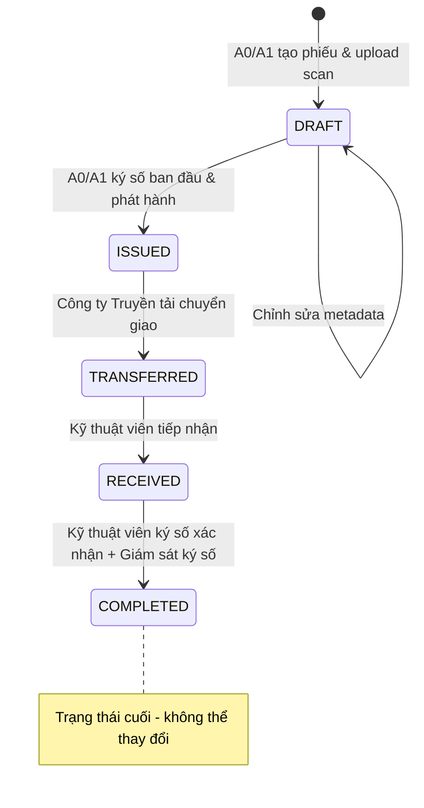
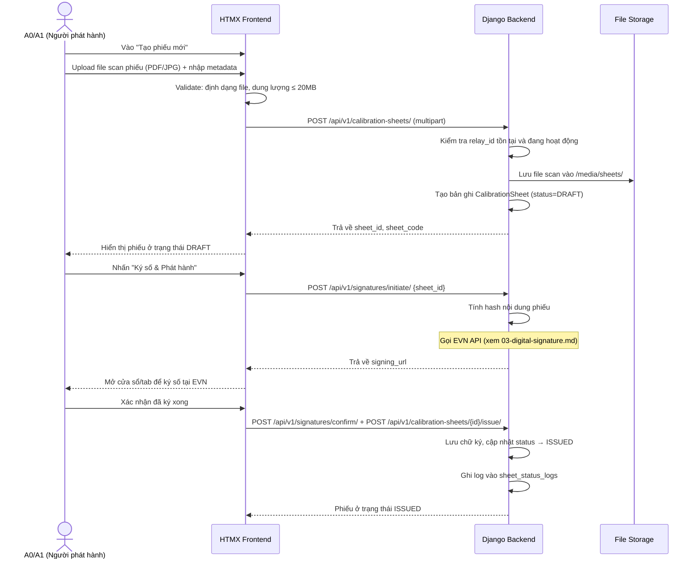
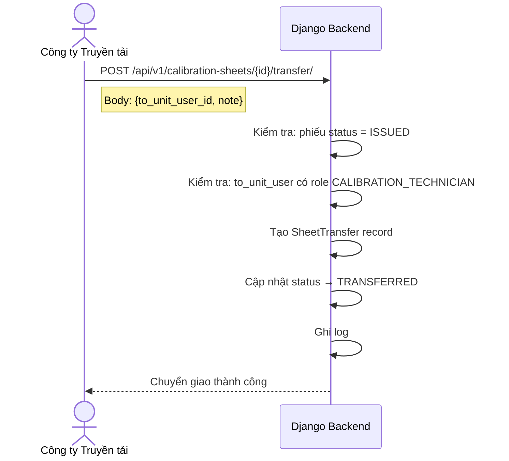
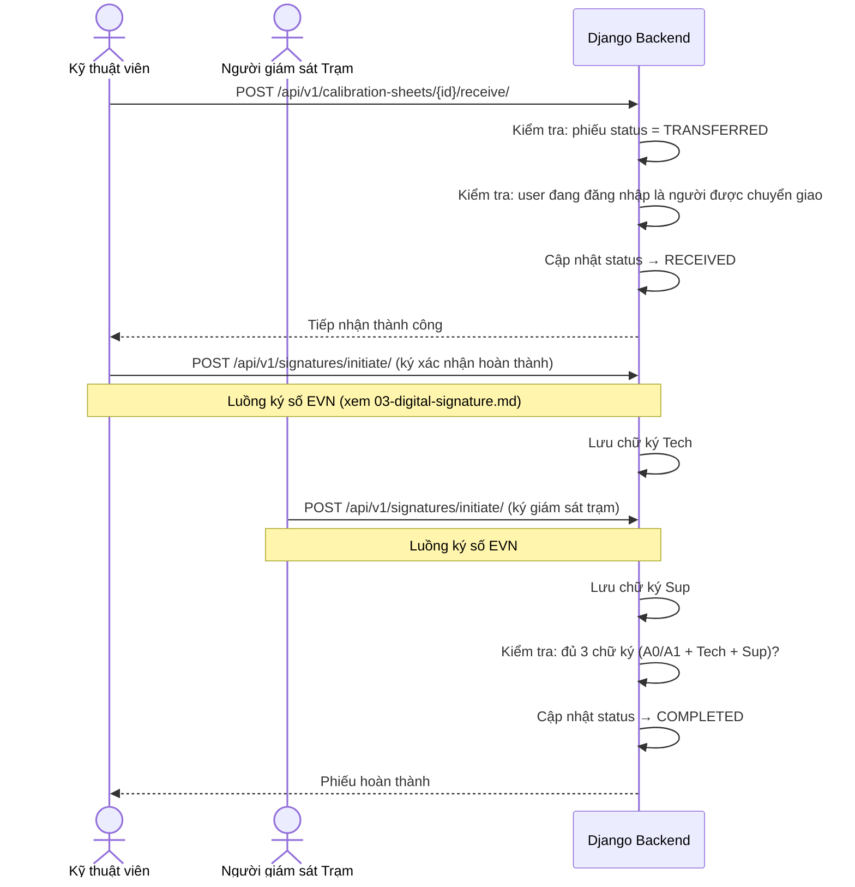

# Phân hệ Quản lý Phiếu Chỉnh định (Calibration Sheet)

**App Django**: `apps/calibration`
**User Stories liên quan**: `[US-SHEET-01]` đến `[US-SHEET-10]`

---

## 1. Tổng quan Nghiệp vụ

Phiếu chỉnh định là tài liệu kỹ thuật quan trọng nhất trong hệ thống, ghi nhận lệnh chỉnh định thông số rơ-le từ Công ty Truyền tải tới Đơn vị chỉnh định. Mỗi phiếu trải qua vòng đời trạng thái nghiêm ngặt.

---

## 2. Vòng đời Trạng thái Phiếu (Sheet Lifecycle)



| Trạng thái | Mô tả | Người có thể hành động |
|---|---|---|
| `DRAFT` | Phiếu mới tạo, chưa phát hành | A0/A1 |
| `ISSUED` | Đã ký số ban đầu & phát hành | Công ty Truyền tải |
| `TRANSFERRED` | Đã chuyển giao cho Đơn vị chỉnh định | Kỹ thuật viên |
| `RECEIVED` | Kỹ thuật viên đã tiếp nhận phiếu | Kỹ thuật viên, Giám sát trạm |
| `COMPLETED` | Đã hoàn thành, có đủ chữ ký xác nhận | — (Chỉ xem) |

---

## 3. Luồng Nghiệp vụ Chi tiết

### 3.1 Import & Phát hành Phiếu [US-SHEET-01..03] — Figure 3



### 3.2 Chuyển giao Phiếu [US-SHEET-04] — Figure 4



### 3.3 Tiếp nhận & Xác nhận Hoàn thành [US-SHEET-06..08] — Figure 5



---

## 4. Business Rules (Quy tắc Nghiệp vụ)

| # | Quy tắc |
|---|---|
| BR-SHEET-01 | Phiếu chỉnh định **không bao giờ bị xóa vật lý** (`is_deleted` = True cho soft delete). |
| BR-SHEET-02 | Phiếu chỉ được phát hành (ISSUED) sau khi có **chữ ký số hợp lệ** của A0/A1. |
| BR-SHEET-03 | Phiếu chỉ được chuyển giao (TRANSFERRED) khi đang ở trạng thái ISSUED. |
| BR-SHEET-04 | Kỹ thuật viên chỉ có thể tiếp nhận phiếu được chuyển **đích danh cho họ**. |
| BR-SHEET-05 | Phiếu chỉ đạt COMPLETED khi có đủ **3 chữ ký số**: A0/A1 + Kỹ thuật viên + Giám sát trạm. |
| BR-SHEET-06 | Mã phiếu (`sheet_code`) tự động sinh theo format: `PHIEU-{YYYY}-{MM}-{SEQUENCE}`. |
| BR-SHEET-07 | Chỉ cho phép upload file: PDF, JPG, JPEG, PNG. Dung lượng tối đa: **20MB**. |

---

## 5. API Request/Response Chi tiết

### POST `/api/v1/calibration-sheets/`
**Content-Type**: `multipart/form-data`

| Field | Type | Bắt buộc | Mô tả |
|---|---|---|---|
| `relay_id` | integer | ✅ | ID rơ-le cần chỉnh định |
| `description` | string | ❌ | Mô tả nội dung phiếu |
| `scan_file` | file | ✅ | File bản scan phiếu |

**Response (201)**:
```json
{
  "success": true,
  "data": {
    "id": 42,
    "sheet_code": "PHIEU-2026-07-001",
    "status": "DRAFT",
    "relay": { "id": 5, "relay_code": "REL_AT1_87T", "relay_name": "Rơ-le so lệch AT1" },
    "scan_file_url": "/media/sheets/2026/07/scan_001.pdf",
    "issued_by": null,
    "issued_at": null,
    "created_at": "2026-07-11T16:30:00Z"
  }
}
```

### GET `/api/v1/calibration-sheets/` (với filter)

**Query Parameters**:
| Param | Mô tả | Ví dụ |
|---|---|---|
| `status` | Lọc theo trạng thái | `?status=ISSUED` |
| `station_id` | Lọc theo trạm | `?station_id=3` |
| `relay_id` | Lọc theo rơ-le | `?relay_id=5` |
| `date_from` | Từ ngày | `?date_from=2026-01-01` |
| `date_to` | Đến ngày | `?date_to=2026-12-31` |
| `search` | Tìm theo mã phiếu | `?search=PHIEU-2026` |
| `page` | Số trang | `?page=2` |

---

## 6. Giao diện (UI Specification)

### Màn hình Chi tiết Phiếu (`/calibration-sheets/:id`)

**Layout**: Chia 2 cột:
- **Cột trái (60%)**: Iframe/viewer hiển thị file scan phiếu
- **Cột phải (40%)**:
  - Thông tin metadata (Mã phiếu, Rơ-le, Ngày phát hành...)
  - **Panel "Trạng thái ký số"**: Hiển thị 3 ô ký số (A0/A1 | Kỹ thuật viên | Giám sát trạm) với badge màu: 🔴 Chưa ký / 🟡 Đang xử lý / 🟢 Đã ký hợp lệ
  - **Timeline lịch sử**: Các bước đã thực hiện theo thứ tự thời gian
  - **Nút hành động**: Hiển thị nút phù hợp với quyền và trạng thái phiếu hiện tại
