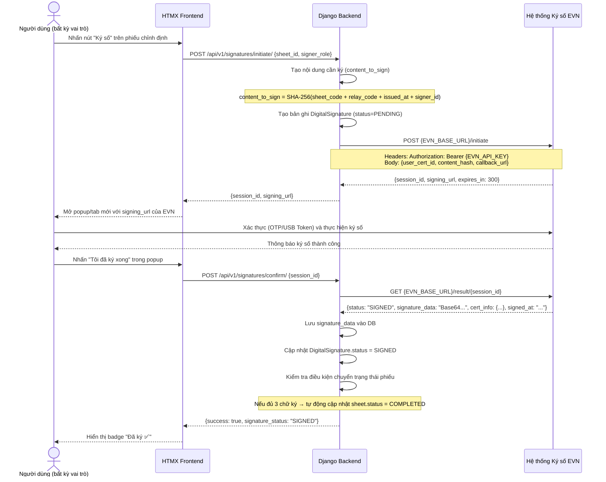

# Phân hệ Ký số Điện tử (Digital Signature — EVN Integration)

**App Django**: `apps/signatures`
**User Stories liên quan**: `[US-SIG-01]` đến `[US-SIG-04]`

---

## 1. Tổng quan Nghiệp vụ

Hệ thống RMS **không tự thực hiện ký số** mà ủy thác toàn bộ quá trình cho **Hệ thống Ký số của EVN** — một hệ thống bên ngoài cung cấp dịch vụ chữ ký số pháp lý cho toàn bộ Tập đoàn Điện lực Việt Nam.

Có **3 loại chữ ký** cần thu thập trên mỗi phiếu chỉnh định:
1. **Chữ ký A0/A1**: Xác nhận phiếu đã được soạn thảo và phát hành.
2. **Chữ ký Kỹ thuật viên**: Xác nhận đã hoàn thành công việc chỉnh định tại trạm.
3. **Chữ ký Giám sát trạm**: Xác nhận kỹ thuật viên đã đến trạm và thực hiện chỉnh định.

---

## 2. Luồng Ký số Chi tiết — Figure 5



---

## 3. Service Layer: `EVNSignatureService`

```python
# apps/signatures/services.py

class EVNSignatureService:
    """
    Dịch vụ tích hợp với Hệ thống Ký số EVN.
    Đóng gói toàn bộ logic giao tiếp với API EVN bên ngoài.
    """

    def initiate_signing_session(self, user, sheet, signer_role: str) -> dict:
        """
        Khởi tạo phiên ký số với EVN.
        Trả về: {session_id, signing_url}
        Raises: EVNServiceUnavailableError nếu EVN API không phản hồi.
        """

    def get_signing_result(self, session_id: str) -> dict:
        """
        Lấy kết quả ký số từ EVN sau khi user hoàn thành.
        Trả về: {status, signature_data, cert_info, signed_at}
        Raises: EVNSessionExpiredError nếu session hết hạn (>5 phút).
        """

    def verify_signature(self, signature_id: int) -> bool:
        """
        Xác thực lại chữ ký số đã lưu với EVN.
        Trả về: True nếu hợp lệ, False nếu đã bị thu hồi/hết hiệu lực.
        """
```

---

## 4. Model: `DigitalSignature`

```python
# apps/signatures/models.py

class DigitalSignature(models.Model):
    # Phiếu chỉnh định được ký
    sheet = models.ForeignKey('calibration.CalibrationSheet', on_delete=models.PROTECT)

    # Người thực hiện ký
    signed_by = models.ForeignKey(settings.AUTH_USER_MODEL, on_delete=models.PROTECT)

    # Vai trò khi ký (A0_A1_ISSUER / CALIBRATION_TECHNICIAN / STATION_SUPERVISOR)
    signer_role = models.CharField(max_length=50)

    # Dữ liệu từ hệ thống EVN
    evn_session_id = models.CharField(max_length=200, unique=True)
    signature_data = models.TextField(null=True, blank=True)  # Base64 chữ ký
    certificate_info = models.JSONField(null=True, blank=True)  # Thông tin chứng thư

    # Trạng thái: PENDING / SIGNED / VERIFIED / INVALID
    signature_status = models.CharField(max_length=20, default='PENDING')

    signed_at = models.DateTimeField(null=True, blank=True)
    verified_at = models.DateTimeField(null=True, blank=True)
    created_at = models.DateTimeField(auto_now_add=True)

    class Meta:
        # Mỗi vai trò chỉ ký một lần trên mỗi phiếu
        unique_together = [('sheet', 'signer_role')]
```

---

## 5. Xử lý Lỗi (Error Handling)

| Tình huống | HTTP Status | error_code | Xử lý |
|---|---|---|---|
| EVN API không phản hồi (timeout) | 503 | `EVN_SERVICE_UNAVAILABLE` | Retry sau 30s, hiển thị thông báo |
| Phiên ký số hết hạn (>5 phút) | 400 | `EVN_SESSION_EXPIRED` | Người dùng phải khởi tạo lại |
| Chữ ký không hợp lệ (EVN từ chối) | 400 | `EVN_SIGNATURE_INVALID` | Log lỗi, không lưu vào DB |
| Người dùng đã ký (trùng vai trò) | 409 | `SIGNATURE_ALREADY_EXISTS` | Hiển thị chữ ký hiện tại |
| Người dùng không có chứng thư EVN | 403 | `EVN_CERT_NOT_FOUND` | Liên hệ Admin để đăng ký chứng thư |

---

## 6. API Endpoints

### POST `/api/v1/signatures/initiate/`
**Quyền**: Authenticated (vai trò phù hợp với phiếu)

**Request**:
```json
{
  "sheet_id": 42,
  "signer_role": "A0_A1_ISSUER"
}
```

**Response (200)**:
```json
{
  "success": true,
  "data": {
    "session_id": "EVN-SESSION-2026071100001",
    "signing_url": "https://sign.evn.com.vn/sign?session=EVN-SESSION-2026071100001",
    "expires_in": 300
  }
}
```

### POST `/api/v1/signatures/confirm/`

**Request**:
```json
{
  "session_id": "EVN-SESSION-2026071100001"
}
```

**Response (200)**:
```json
{
  "success": true,
  "data": {
    "signature_id": 15,
    "signer_role": "A0_A1_ISSUER",
    "signature_status": "SIGNED",
    "signed_at": "2026-07-11T10:00:00Z",
    "sheet_new_status": "ISSUED"
  }
}
```

---

## 7. Giao diện (UI Specification)

### Panel Trạng thái Ký số (trong màn hình Chi tiết Phiếu)

```
┌─────────────────────────────────────────┐
│  TRẠNG THÁI CHỮ KÝ SỐ                  │
├─────────────────────────────────────────┤
│  ✅ A0/A1 Phát hành                     │
│     Nguyễn Văn A • 11/07/2026 09:30    │
├─────────────────────────────────────────┤
│  ✅ Kỹ thuật viên                       │
│     Trần Văn B • 12/07/2026 14:00      │
├─────────────────────────────────────────┤
│  ⏳ Giám sát Trạm                       │
│     Chưa ký   [Nhấn để ký số →]        │
└─────────────────────────────────────────┘
```

- Badge `✅ Đã ký` màu xanh lá
- Badge `⏳ Chưa ký` màu vàng + nút "Ký số" (chỉ hiển thị với người có quyền ký)
- Badge `❌ Không hợp lệ` màu đỏ (khi xác thực lại thất bại)
