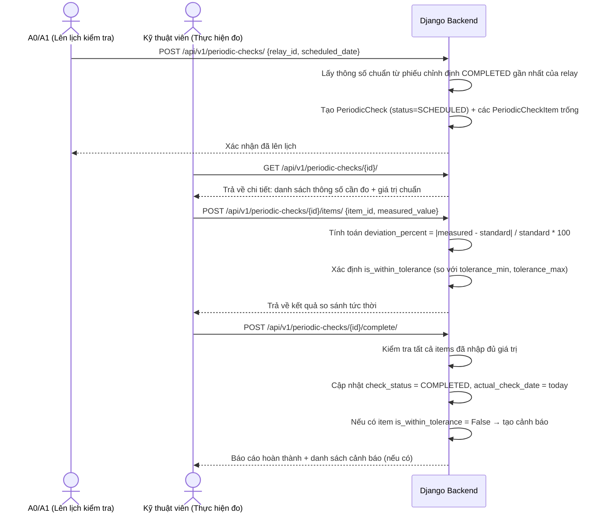

# Phân hệ Kiểm tra Định kỳ & So sánh Thông số Rơ-le (Periodic Check)

> [!WARNING]
> Phân hệ này phụ thuộc vào Module Tài sản (Trạm/Ngăn lộ/Rơ le) nên đã được dời ra khỏi phiên bản MVP theo SRS mới nhất. Tài liệu dưới đây mang tính chất tham khảo cho tương lai.

**App Django**: `apps/periodic_checks`
**User Stories liên quan**: `[US-CHK-01]` đến `[US-CHK-05]`

---

## 1. Tổng quan Nghiệp vụ

Kiểm tra định kỳ là quy trình đo đạc thực tế thông số rơ-le tại trạm theo lịch định kỳ (thường là hàng quý hoặc hàng năm), sau đó so sánh với **thông số chuẩn** đã được ghi trong phiếu chỉnh định cuối cùng (`COMPLETED`) để phát hiện sai lệch. Đây là Figure 2 trong tài liệu gốc.

---

## 2. Luồng Nghiệp vụ Chi tiết — Figure 2



---

## 3. Cách tính Sai lệch (Deviation Calculation)

```python
# apps/periodic_checks/models.py

class PeriodicCheckItem(models.Model):
    """
    Kết quả đo một thông số cụ thể trong đợt kiểm tra định kỳ.
    """
    check = models.ForeignKey(PeriodicCheck, on_delete=models.CASCADE, related_name='items')

    # Tham chiếu đến thông số định mức của rơ-le (RelaySetting)
    setting = models.ForeignKey('stations.RelaySetting', on_delete=models.PROTECT)

    # Giá trị đo được thực tế tại trạm
    measured_value = models.DecimalField(max_digits=12, decimal_places=4, null=True)

    # Sai lệch so với giá trị chuẩn (%)
    deviation_percent = models.DecimalField(max_digits=8, decimal_places=2, null=True)

    # True nếu nằm trong ngưỡng cho phép (tolerance_min ≤ measured ≤ tolerance_max)
    is_within_tolerance = models.BooleanField(null=True)

    note = models.TextField(blank=True)

    def calculate_deviation(self):
        """
        Tự động tính sai lệch % và kiểm tra ngưỡng khi lưu giá trị đo.
        """
        if self.measured_value is None:
            return
        std = self.setting.standard_value
        if std != 0:
            self.deviation_percent = abs(self.measured_value - std) / abs(std) * 100
        self.is_within_tolerance = (
            self.setting.tolerance_min <= self.measured_value <= self.setting.tolerance_max
        )
```

---

## 4. Business Rules (Quy tắc Nghiệp vụ)

| # | Quy tắc |
|---|---|
| BR-CHK-01 | Chỉ tạo lịch kiểm tra cho rơ-le đang hoạt động (`is_active=True`). |
| BR-CHK-02 | Thông số chuẩn lấy từ phiếu chỉnh định `COMPLETED` **gần nhất** của rơ-le đó. |
| BR-CHK-03 | Nếu chưa có phiếu chỉnh định nào hoàn thành, lấy thông số từ `relay_settings` (thông số định mức ban đầu). |
| BR-CHK-04 | Hệ thống **tự động cảnh báo** khi có bất kỳ thông số nào vượt ngưỡng (`is_within_tolerance = False`). |
| BR-CHK-05 | Đợt kiểm tra chỉ được đóng (COMPLETED) khi **tất cả** thông số đã được nhập giá trị đo. |
| BR-CHK-06 | Không thể chỉnh sửa kết quả đo sau khi đợt kiểm tra đã đóng (COMPLETED). |

---

## 5. API Endpoints Chi tiết

### POST `/api/v1/periodic-checks/`
**Quyền**: `A0_A1_ISSUER`, `TRANSMISSION_COMPANY`

**Request**:
```json
{
  "relay_id": 5,
  "scheduled_date": "2026-08-15",
  "note": "Kiểm tra định kỳ quý 3/2026"
}
```

**Response (201)**:
```json
{
  "success": true,
  "data": {
    "id": 10,
    "relay": { "id": 5, "relay_code": "REL_AT1_87T" },
    "check_status": "SCHEDULED",
    "scheduled_date": "2026-08-15",
    "items": [
      {
        "id": 101,
        "parameter_code": "ID_MIN",
        "parameter_name": "Dòng khởi động tối thiểu",
        "standard_value": 0.2,
        "unit": "A",
        "tolerance_min": 0.18,
        "tolerance_max": 0.22,
        "measured_value": null,
        "deviation_percent": null,
        "is_within_tolerance": null
      }
    ]
  }
}
```

### POST `/api/v1/periodic-checks/{id}/items/`
**Quyền**: `CALIBRATION_TECHNICIAN`

**Request**:
```json
{
  "item_id": 101,
  "measured_value": 0.195,
  "note": "Đo lúc 8h sáng, nhiệt độ 28°C"
}
```

**Response (200)**:
```json
{
  "success": true,
  "data": {
    "item_id": 101,
    "measured_value": 0.195,
    "standard_value": 0.2,
    "deviation_percent": 2.5,
    "is_within_tolerance": true,
    "tolerance_min": 0.18,
    "tolerance_max": 0.22
  }
}
```

### GET `/api/v1/relays/{id}/check-history/`
**Quyền**: Authenticated

**Response**: Danh sách các đợt kiểm tra của rơ-le, mỗi đợt gồm tóm tắt kết quả:
```json
{
  "data": [
    {
      "check_id": 10,
      "actual_check_date": "2026-08-15",
      "check_status": "COMPLETED",
      "total_items": 5,
      "out_of_tolerance_count": 0
    },
    {
      "check_id": 7,
      "actual_check_date": "2026-05-10",
      "check_status": "COMPLETED",
      "total_items": 5,
      "out_of_tolerance_count": 1
    }
  ]
}
```

---

## 6. Giao diện (UI Specification)

### Màn hình Nhập Kết quả Kiểm tra (`/periodic-checks/:id`)

**Layout**: Bảng so sánh thông số với màu highlight:

| Thông số | Giá trị chuẩn | Dung sai | Giá trị đo được | Sai lệch (%) | Kết quả |
|---|---|---|---|---|---|
| Dòng khởi động (ID_MIN) | 0.200 A | [0.18 – 0.22] | `[_____]` | — | — |
| Thời gian tác động cấp 1 (TD_1) | 0.000 s | [0.00 – 0.02] | `[_____]` | — | — |

- Sau khi nhập giá trị: hiển thị ngay sai lệch % và badge **✅ Trong ngưỡng** (xanh) hoặc **⚠️ Vượt ngưỡng** (đỏ) mà không cần reload trang.

### Màn hình Báo cáo & Biểu đồ (`/periodic-checks/:id/report`)

- **Recharts LineChart**: Biểu đồ đường hiển thị xu hướng từng thông số qua các đợt kiểm tra.
- **X-axis**: Ngày kiểm tra | **Y-axis**: Giá trị đo được
- **Reference lines**: Đường kẻ màu vàng (tolerance_min) và xanh (tolerance_max) để dễ so sánh
- Xuất báo cáo: Nút "Tải PDF" (sử dụng browser print / pdf.js/browser print)
