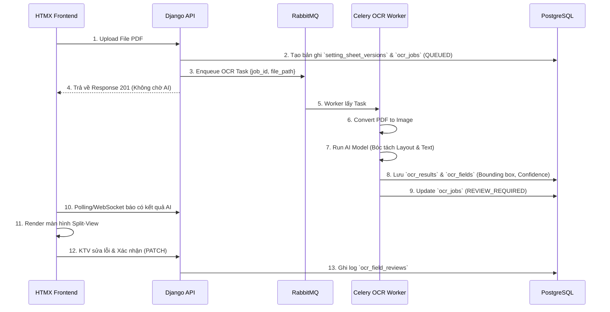

# Đặc tả Module AI OCR (Human-in-the-Loop)

Tài liệu này mô tả chi tiết kiến trúc, quy trình và yêu cầu kỹ thuật cho hệ thống AI bóc tách thông số (OCR) từ Phiếu chỉnh định dạng PDF/Image trong hệ thống **RMS**.

---

## 1. Mục tiêu Kiến trúc

1. **Bảo mật tuyệt đối (OT Compliance)**: Toàn bộ quá trình xử lý hình ảnh và bóc tách dữ liệu phải được thực hiện trên hạ tầng máy chủ nội bộ (On-premise). Tuyệt đối **không gửi** dữ liệu sang các dịch vụ Cloud bên ngoài (Google Cloud Vision, AWS Textract, etc.).
2. **Xử lý Bất đồng bộ (Asynchronous)**: Việc OCR tốn nhiều tài nguyên, không được chặn (block) request của người dùng khi upload file.
3. **Độ tin cậy dữ liệu**: Kết quả AI chỉ mang tính chất tham khảo (Draft). Bắt buộc phải có **sự đối chiếu và xác nhận của con người (Human-in-the-loop)** thông qua giao diện Split-view.

---

## 2. Các Thành phần Hệ thống

### 2.1 Backend / API (Django)
- Cung cấp API để nhận file PDF, lưu vào kho lưu trữ nội bộ.
- Sinh Task đẩy vào Message Broker.
- Cung cấp API cập nhật (PATCH) và chốt (POST) kết quả OCR sau khi người dùng review.

### 2.2 Task Queue & Message Broker (RabbitMQ)
- Quản lý hàng đợi các Task OCR (`ocr_jobs`).
- Hỗ trợ Retry có giới hạn khi Worker quá tải hoặc lỗi.

### 2.3 AI OCR Worker (Celery + Tesseract / PaddleOCR)
- Một service độc lập chạy ngầm.
- Xử lý convert PDF trang sang ảnh.
- Nhận diện ký tự, phân tích layout (bảng biểu).
- Trả kết quả JSON chứa: Text nguyên thủy, Key-Value đã bóc tách, Bounding Box (Toạ độ), Confidence Score.

---

## 3. Luồng Xử lý AI OCR (Workflow)

---

## 4. Giao diện Đối chiếu OCR (Split-View)

Màn hình Split-view là điểm tiếp xúc giữa con người và AI, yêu cầu thiết kế UX/UI tối ưu:

- **Khung bên trái (Trình xem PDF/Ảnh)**:
  - Phải hỗ trợ Zoom, cuộn trang.
  - Khi hover/click vào một thông số bên khung phải, hệ thống vẽ highlight (dựa trên bounding box) vào vị trí tương ứng trên ảnh.
- **Khung bên phải (Form dữ liệu)**:
  - Hiển thị danh sách các thông số AI đã bóc tách được.
  - Cảnh báo màu vàng (Warning) với những trường có Confidence Score < Ngưỡng (VD: < 80%).
  - Textbox có thể chỉnh sửa trực tiếp.
  - Mỗi khi sửa, người dùng được yêu cầu nhập "Lý do thay đổi" để lưu vết (Audit log).
- **Trạng thái chốt sổ**: Nút "Xác nhận toàn bộ dữ liệu" chỉ được phép bấm khi người dùng đã duyệt/xác nhận các trường dữ liệu quan trọng hoặc có Confidence thấp.

---

## 5. Xử lý Lỗi & Retry

- Lỗi không đọc được file (Corrupted PDF) → Cập nhật trạng thái `FAILED`, ghi rõ `error_message`, gửi thông báo cho người dùng.
- AI Worker crash / Timeout → RabbitMQ tự động đẩy lại Task (Max 3 retries).
- File quá dài (> 50 trang) → AI Worker có thể ngắt tác vụ, chuyển trạng thái về `FAILED_TOO_LARGE`, yêu cầu người dùng cắt nhỏ file.

---

## 6. Yêu cầu Huấn luyện (Future Scope)
Trong tương lai, để nâng cao độ chính xác:
- Có thể thu thập các mẫu phiếu đã được KTV đối chiếu (dữ liệu sạch) để huấn luyện lại mô hình (Fine-tuning PaddleOCR hoặc mô hình LayoutLM).
- Việc huấn luyện phải được thực hiện trên môi trường Sandbox chuyên dụng nội bộ, không dùng dữ liệu production chạy thẳng ra ngoài.
